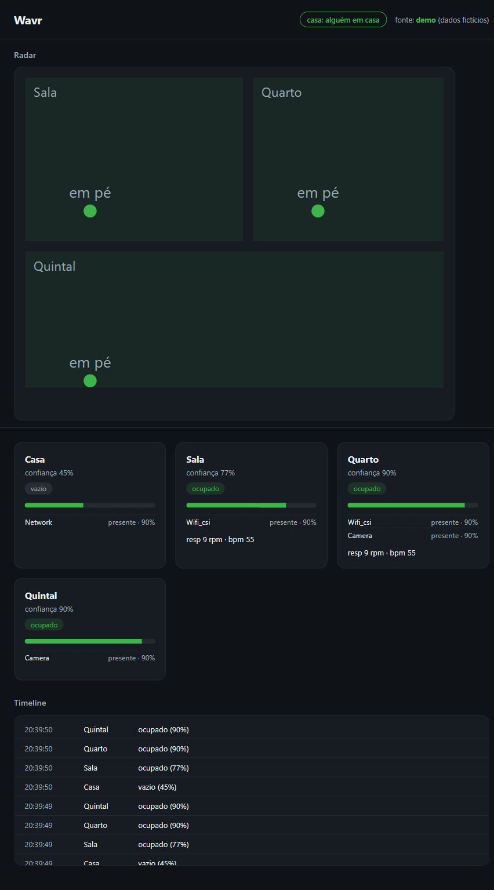

# Wavr — Fused Home Sensing

[](https://github.com/augbastos/wavr/actions/workflows/tests.yml)
[](LICENSE)

**Your home, understood — without giving it away.**

Wavr is a local, explainable, privacy-first presence and network dashboard for your home — one you
(and your agents) can actually query. It fuses several sensing modalities into a single *explainable*
`RoomState` per room: occupied or not, a confidence score, and the per-modality *why* behind it — over
a floor plan you draw yourself. Nothing leaves the box unless you turn on an optional, clearly-labelled
egress. No account, no cloud, no telemetry.

- **Local-only, zero cloud egress by default** — runs on your own hardware (laptop to Raspberry Pi),
  loopback-only out of the box. The only paths off the machine are opt-in and default-OFF.
- **Explainable fusion** — `confidence = agreement × strength`; the dashboard always shows *why* a room
  reads occupied, per modality, with trust weights you can see.
- **You are admin, totally** — you draw the rooms, toggle every sensor on and off, and choose what (if
  anything) is ever shared. Cameras boot OFF; credentials never leave the box.

**Try it locally (no backend, no hardware):** open `frontend/index.html` — off-localhost the dashboard
self-switches to a built-in simulator (simulated data only, zero network requests).



## What's real today

Everything below ships in this tree and is tested (hardware is mock-tested where the physical device
isn't required).

- **Multi-modal fusion** — a small `SensorSource` seam feeds one transparent fusion engine:
  - **Network scan** — presence from LAN device activity. Works today with **zero extra hardware**.
  - **BLE presence** — the host Bluetooth adapter as a modality (lazy `bleak`).
  - **Camera** — RTSP person-detection via the `[camera]` extra (torch/cv2), lazily loaded. Cameras
    boot **OFF**; frames are processed in RAM and never persisted (ADR-0002).
  - **mmWave radar** — the HLK-LD2450 parser and source are written and mock-tested; running it on the
    physical ~€15 device is a planned step.
  - **WiFi CSI (ruview)** — a source seam for channel-state-information presence.
- **3D house map + in-app editor** — draw multi-floor rooms, walls, and stairs in meters, right in the
  dashboard; persisted via `PUT /api/house` (central-only). The authored geometry is the coordinate
  frame the sensors report into.
- **Sensing-mode meter** — a top-level **Off / Presence / Precise** control that shows how much of your
  home Wavr is actually sensing right now, and lets you switch camera person-detection on or off. It
  states honestly that *Precise* processes video in memory, on your GPU, and never sends it anywhere.
- **Device liveness — an unplugged camera never fakes presence** — fusion runs a periodic re-fuse pass
  (`WAVR_REFUSE_S`, default 5s) against the wall clock, so a source that stops reporting **decays to
  zero instead of freezing** at its last reading. A camera that is unplugged or disabled is latched
  *down* by the health monitor after `WAVR_CAM_UNHEALTHY_SECS`, and the map paints that room as **offline
  (amber, never trusted-empty)** — visibly distinct from a sensor-confirmed empty room and from a room
  with **no coverage** at all. The liveness signal carries camera *names* and an enum only — never a
  frame, URL, or credential.
- **Multi-device pairing** — a phone or second PC on the same Wi-Fi pairs with the desktop "central":
  local **HTTPS/WSS** (auto self-signed cert via `python -m wavr.serve`), a **rotating 8-digit pairing
  code** that auto-refreshes on screen (single-use, 120s TTL, rate-limited) so you never race the clock,
  per-device hashed revocable tokens, single-use WS tickets, and an in-subnet real-peer check. At pairing
  you verify an **out-of-band certificate fingerprint** — read it off the trusted loopback dashboard,
  compare it against what the phone's browser shows — which defeats a pairing-time TLS man-in-the-middle.
  Devices pair with a **role — Admin (full control) or User (read-only)** — and a device's role can be
  changed after pairing (Admin-only; a User can never promote itself). Opt-in, default-OFF, zero cloud
  (ADR-0006).
- **Who is home (non-biometric)** — an **opt-in, default-OFF** identity layer maps a known device
  (a phone's Bluetooth address or Wi-Fi MAC) to a named person, so the dashboard can show *who* is home —
  **not just that someone is**. It is **house-level** (one adapter localizes to the house, not a room —
  Wavr says so, never faking per-room identity) and **non-biometric** (device-to-person, no faces). With
  the flag off, no person label is ever created, so it can't leak to `/api/state`, the DB, or an agent.
  Person labels are stripped from the MCP read path as PII. **Face recognition is a separate, gated,
  undecided item — not shipped**.
- **MCP "brain on Home Assistant"** — Wavr exposes `RoomState` and the house map to agents (read-only),
  **plus** an opt-in gated control tool (`WAVR_MCP_CONTROL`, default-OFF) that asks Home Assistant to
  run a service. Allowlist + consent refusal on both the service *and* the target entity; camera / lock
  / scene refused even if allowlisted; mass actuation blocked; every call audit-logged. Wavr never
  becomes a device driver (ADR-0005).
- **Desktop Tauri shell** — a native desktop wrapper (`desktop/`) around the backend + dashboard so the
  "Wavr desktop is the central" story ships as one app (ADR-0007).
- **Installable PWA** — the dashboard is an installable Progressive Web App (manifest + service worker)
  that caches only the shell and makes zero external requests.
- **Defensive LAN inventory ("Wavr Net")** — offline OUI vendor + device-type classification,
  rogue-device / gateway-MAC / rogue-DHCP alerts on a five-tier ladder, and opt-in port/speed/WOL
  utilities. Defensive only (ADR-0004) — Wavr never surveils a network the host isn't authorized on.

## The honest limitations

- **A camera only sees where it looks.** Camera presence is **room-level** (which room a person is in,
  where a camera is pointed) — not per-person map coordinates yet.
- **Most rooms need a sensor to see them.** A room with no live sensor shows as **no coverage** — Wavr
  says so rather than guessing. Blind, offline, and confirmed-empty are three distinct states on the map.
- **Live posture (standing/sitting/lying) is planned**, not shipped — it needs YOLO-pose on a GPU.
- **mmWave x/y target tracking** needs the physical LD2450; the code is written and mock-tested but
  hasn't been run on-device here.
- **AR floor-plan measuring and a native mobile app are planned**. Non-biometric "who is
  home" ships today (opt-in, default-OFF); **face recognition** specifically is explicitly gated and
  undecided.

Wavr does not reimplement sensing research — it orchestrates sensing engines as plugins and is honest
about each one's confidence. When an upstream engine's headline feature is weaker than its README, Wavr
consumes what actually works and the trust weights tell the truth.

## The privacy contract

- **Loopback-only by default** — peer check + Host allowlist + CSRF header. The base install never
  opens a LAN socket.
- **Cameras boot OFF.** Frames live in RAM only, are never written to disk, and never leave the box
  (ADR-0002). Position targets are live-only — never SQLite, never MQTT.
- **Only derived state is ever stored or (optionally) published** — occupancy / confidence / timestamp.
  Never frames, never raw targets, never credentials. Credentials are never logged or echoed.
- **Every egress is opt-in and default-OFF** — LAN multi-device (TLS), MQTT to Home Assistant (derived
  state only), the MCP control tool, and the optional natural-language narrator. Turn none on and Wavr is
  an island. **The narrator is provider-agnostic** — point it at a **local Ollama** (or any loopback
  OpenAI-compatible server) and even that last summarizing step stays on your box with **zero cloud
  egress**; or pick Gemini / OpenAI / Claude if you'd rather (opt-in cloud). Every provider is fed the
  same allowlisted prompt — occupancy and confidence only, never a frame, vital, MAC, or credential.
- **No analytics, no telemetry SDK, no account.** The frontend makes zero external requests; the public
  simulator declares itself fake on screen.

## Quickstart (network presence, zero hardware)

```powershell
cd backend; pip install -e .[dev]; cd ..
# optional .env at repo root:
#   WAVR_NET_MACS=<your phone's wifi MAC>
#   WAVR_FUSION_THRESHOLD=0.35   # network-only phase; revert to 0.5 when camera/CSI join
python -m wavr.serve            # loopback-only HTTP on http://127.0.0.1:8000
```

Tests: `python -m pytest backend/tests -q` (full suite, all hardware mock-tested).

For the desktop app + LAN companions, set `WAVR_MULTIDEVICE=1` and see
[`docs/deploy/multi-device.md`](docs/deploy/multi-device.md) (`python -m wavr.serve` then brings up local
TLS + pairing) and the Tauri shell in [`desktop/`](desktop/).

## Architecture

```
sources (network / ruview CSI / camera / mmwave / BLE / sim)
   └─> SensingEvent (+ Target: x/y, posture)
        └─> FusionEngine (agreement × strength, explainable weights, wall-clock ageing)
             └─> RoomState ─> WS /ws/live + REST ─> dashboard (cards + radar + house map)
                  ├─> SQLite (derived state only — never frames, never targets)
                  ├─> RulesEngine / AwayMonitor ─> MQTT (opt-in; occupied/confidence/ts only)
                  ├─> MCP server (read RoomState/map; opt-in gated HA control)
                  └─> Narrator ─> your LLM (Ollama local = ZERO egress; or Gemini/OpenAI/Claude = opt-in cloud)
```

- **Backend:** Python 3.11, FastAPI, zero mandatory heavy deps — torch/cv2, pyserial, paho, bleak,
  cryptography and genai are lazy optional extras (`[camera]`, `[mmwave]`, `[mqtt]`, `[tls]`, `[genai]`).
- **Frontend:** single static HTML file (three.js), no build step, installable as a PWA. Off-localhost it
  self-switches to a simulator and makes zero requests to the backend.

## Design stance: your home, understood — without giving it away

The industry's default trajectory is the opposite of this project: your home read by someone else's
cloud, from operator-grade network sensing to the 6G push for joint communication-and-sensing, where the
radio layer itself becomes a sensor you don't control. Wavr is the sovereign counter-position — the same
sensing techniques, run on hardware you own, with the data staying on it. Local-only isn't a limitation
here; it's the whole point. You get your home understood without renting the understanding back from
anyone.

## Contributing

Issues and PRs welcome. Ground rules: privacy invariants are non-negotiable (nothing leaves the LAN
except an opt-in egress you enabled; frames are never persisted; new sources must be mock-testable
without hardware), and every PR needs green tests (`python -m pytest backend/tests -q`). Good first
contributions: a new `SensorSource` (zigbee occupancy, a new BLE beacon type, …).

## Docs

- `PRODUCT.md` — product definition and design principles
- `docs/deploy/` — hardening, Docker, hardware tiers, multi-device bring-up
- `docs/adr/` — architecture decision records (0001–0007: mmWave-over-fork, RAM-only privacy
  boundaries, not-a-medical-device, defensive-only, MCP control boundary, authenticated LAN access,
  desktop shell)

## License

[AGPL-3.0-or-later](LICENSE) — Wavr is free and open source for personal, self-hosted, and
non-commercial use. If you run a modified version as a network service, the AGPL requires you to publish
your changes. A **commercial / dual license** (to use Wavr without the AGPL's network-copyleft
obligations) is available from the author — open an issue to enquire.
</content>
</invoke>
