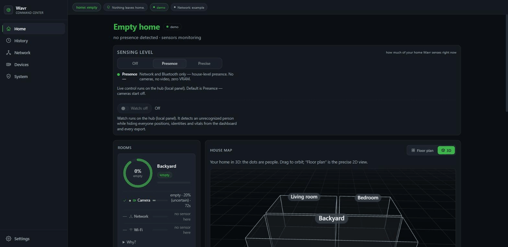
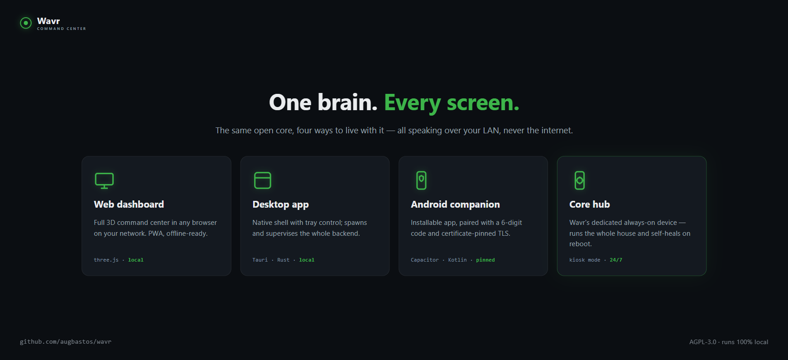
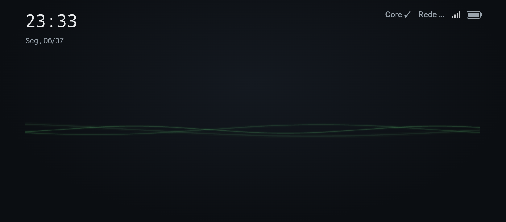
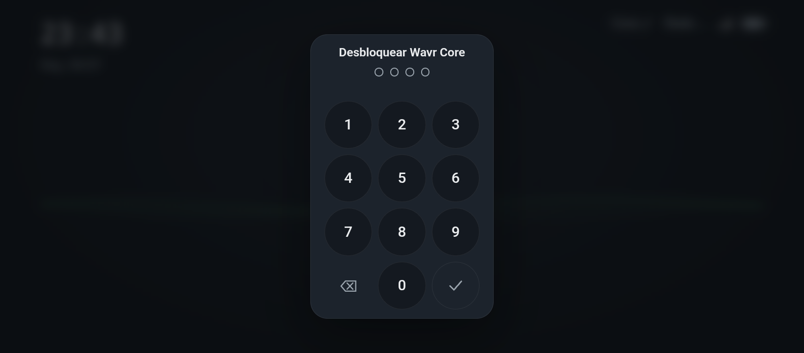
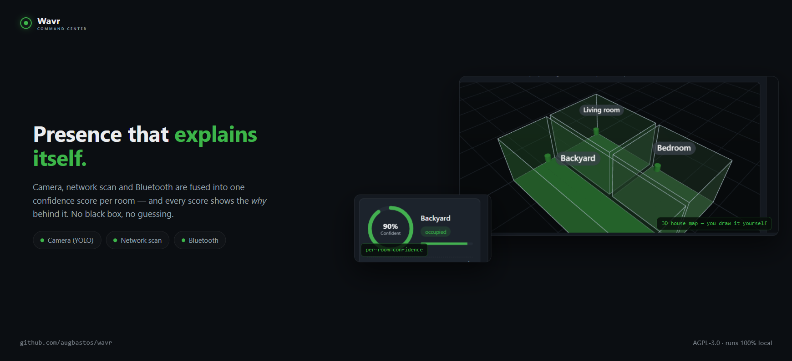
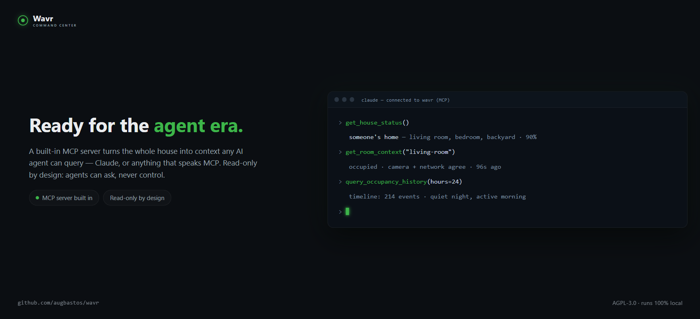

# 🌊 Wavr — Local, Explainable Home Sensing for AI Agents

[](https://github.com/augbastos/wavr/actions/workflows/tests.yml)
[](LICENSE)

**2,479 tests · 144 test files · 121 modules · 8 ADRs · 9 network-fix guides · 6 sensing modalities · local-only · MCP-for-agents · AGPL-3.0**

**Local, explainable home sensing your AI agents can query over MCP — runs 100% on hardware you own.**

Built by **Augusto Bastos** — portfolio [augustobastos.pages.dev](https://augustobastos.pages.dev) · open to AI / multi-agent-orchestration roles.



Wavr fuses several sensing modalities into a single *explainable* `RoomState` per room: occupied or
not, a confidence score, and the per-modality *why* behind it — over a floor plan you draw yourself.
It ships a read-only MCP server so your own agents can query "who's home" as structured context, no
scraping required — see [MCP for agents](#mcp-for-agents) below. Nothing leaves the box unless you turn
on an optional, clearly-labelled egress. No account, no cloud, no telemetry.

- **🤖 Built for agents** — a read-only MCP server (stdio + HTTP) exposes `RoomState` and the house map
  as structured context for your own agents, plus an opt-in, default-OFF, gated Home Assistant control
  tool. See [MCP for agents](#mcp-for-agents) below.
- **🔍 Explainable fusion** — fused `confidence = strength`: the best present evidence (trust weight ×
  the source's own confidence × freshness decay), so a lone weak source never fakes 100%. Every
  source's own reading is surfaced, never silently arbitrated — disagreement-weighting is designed-for
  but inert today.
- **🏠 Local-only, zero cloud egress by default** — runs on your own hardware (laptop, Raspberry Pi, or a
  dedicated phone), loopback-only out of the box. The only paths off the machine are opt-in and default-OFF.
- **🛡️ You are admin, totally** — you draw the rooms, toggle every sensor on and off, and choose what (if
  anything) is ever shared. Cameras boot OFF; credentials never leave the box.

**Try it locally (no backend, no hardware):** open `frontend/index.html` — off-localhost the dashboard
self-switches to a built-in simulator (simulated data only, zero network requests).


## 🧩 The Wavr family

Wavr is a small family of surfaces around one local fusion engine — pick the ones you need, add more over time. Every surface talks to the central over the same authenticated, local-only channel. Maturity is honest, not inflated:

- **Desktop** *(solid)* — the full dashboard as a native Tauri app; the machine that runs it is the "central".
- **MCP** *(solid)* — a read-only Model Context Protocol surface so your own agents can query presence over the LAN, with an opt-in, gated Home-Assistant control tool.
- **Mobile** *(in dev)* — an Android-first companion (native shell) that pairs to a central over pinned TLS.
- **Core** *(early / experimental)* — an always-on appliance (a dedicated phone or Raspberry Pi) that *is* the household hub: an ambient on-screen panel, zero-config mDNS discovery, and a boots-into-Wavr kiosk launcher.
- **Nodes** *(planned)* — cheap ESP32 + mmWave sensor nodes reporting presence over the pinned transport.





*The Core ambient panel: a calm green-wave presence face with glance-free status — time, Core & network health, Wi-Fi and battery — running on a dedicated phone in a stand.*



*Glance-free, control-gated: the ambient face is always readable; waking the full dashboard takes the admin PIN or biometric.*

## ✅ What's real today

Each item below ships in this tree with tests (hardware modalities are mock-tested where the physical
device isn't required). Full detail: `PRODUCT.md`, `docs/adr/`.



- <a id="mcp-for-agents"></a>**MCP for agents, read-only by default** — a stdio and HTTP MCP server
  exposes `RoomState` and the house map so your own agents can query presence as structured context; an
  opt-in, default-OFF, gated Home Assistant control tool sits behind an allowlist + audit log
  (ADR-0005, ADR-0008).
  <details><summary>Detail</summary>

  Allowlist + consent refusal on both the service *and* the target entity; camera / lock / scene
  refused even if allowlisted; mass actuation blocked; every call audit-logged. Person labels are
  stripped from the MCP read path as PII.
  </details>

- **Multi-modal fusion, explainable by construction** — 6 sensing sources (network scan, BLE, camera,
  mmWave, WiFi CSI/ruview, simulator) feed one `FusionEngine`. Fused `confidence` equals `strength` —
  trust weight × the source's own confidence × freshness decay — so a lone weak source never fakes
  100%, and every source's own reading rides in `sources[]`, never silently arbitrated.
  <details><summary>Per-modality status</summary>

  - Network scan — works today, zero extra hardware.
  - BLE presence — host Bluetooth adapter (lazy `bleak`).
  - Camera — RTSP person-detection via the `[camera]` extra (torch/cv2), lazy-loaded; boots **OFF**,
    frames processed in RAM, never persisted (ADR-0002).
  - mmWave radar — HLK-LD2450 parser is written and mock-tested; running it on the physical ~€15
    device is a planned step.
  - WiFi CSI (ruview) — a source seam for channel-state-information presence.
  - A periodic re-fuse pass (`WAVR_REFUSE_S`, default 5s) decays a stopped source to zero instead of
    freezing on its last reading; an unhealthy camera is latched down and painted **offline (amber)**,
    visibly distinct from a sensor-confirmed empty room or a room with no coverage at all.
  </details>

- **3D house map + live sensing control** — draw multi-floor rooms, walls, and stairs yourself, in
  meters, persisted via `PUT /api/house`; a top-level **Off / Presence / Precise** meter shows exactly
  how much of the home Wavr is sensing right now and lets you toggle camera detection on or off.

- **Locally authenticated, scoped multi-device access** — Wavr Pass gives each paired device
  role-based scopes (read / control / admin) enforced per-route on the box (ADR-0006); pairing uses
  local HTTPS/WSS, a rotating single-use 8-digit code, and an out-of-band certificate-fingerprint check
  that defeats a pairing-time MITM.
  <details><summary>Detail</summary>

  Per-device hashed revocable tokens, single-use WS tickets, an in-subnet real-peer check. A device's
  role can be changed after pairing (Admin-only; a User can never promote itself). Opt-in, default-OFF,
  zero cloud.
  </details>

- **Non-biometric "who is home"** — an opt-in, default-OFF layer maps a known device (Bluetooth
  address or Wi-Fi MAC) to a named person; house-level, not per-room, and non-biometric (device-to-person,
  no faces). Stripped from the MCP read path as PII when the flag is off. Face recognition specifically
  is a separate, gated, undecided item — not shipped.

- **Ships as a desktop app + installable PWA** — a native Tauri shell (`desktop/`, ADR-0007) and a
  zero-build installable Progressive Web App that makes zero external requests off-localhost. Wavr Core
  (dedicated always-on hub) is early / experimental — see maturity tags above.

- **Defensive LAN inventory + honest network diagnosis** — offline OUI vendor/device-type
  classification, rogue-device / gateway-MAC / rogue-DHCP alerts on a five-tier ladder (ADR-0004,
  defensive-only), and a network doctor that names a *likely* cause without ever confirming blame —
  backed by 9 fix guides in [`docs/network-fixes/`](docs/network-fixes/).



## ⚠️ The honest limitations

- **A camera only sees where it looks.** Camera presence is **room-level** (which room a person is in,
  where a camera is pointed) — not per-person map coordinates yet.
- **Most rooms need a sensor to see them.** A room with no live sensor shows as **no coverage** — Wavr
  says so rather than guessing. Blind, offline, and confirmed-empty are three distinct states on the map.
- **Live posture (standing/sitting/lying) is planned**, not shipped — it needs YOLO-pose on a GPU.
- **mmWave x/y target tracking** needs the physical LD2450; the code is written and mock-tested but
  hasn't been run on-device here.
- **The Core appliance and the mobile app are early** — the Core panel, discovery, and launcher run, but
  the phone form-factor adds trust boundaries (co-resident apps, physical touch) still being hardened;
  treat a Core as a personal project appliance, not a shipped product. AR floor-plan measuring is planned.
- **Face recognition** specifically is explicitly gated and undecided; non-biometric "who is home" ships
  today (opt-in, default-OFF).

Wavr does not reimplement sensing research — it orchestrates sensing engines as plugins and is honest
about each one's confidence. When an upstream engine's headline feature is weaker than its README, Wavr
consumes what actually works and the trust weights tell the truth.

## 🔒 The privacy contract

- **Loopback-only by default** — peer check + Host allowlist + CSRF header. The base install never
  opens a LAN socket.
- **Cameras boot OFF.** Frames live in RAM only, are never written to disk, and never leave the box
  (ADR-0002). Position targets are live-only — never SQLite, never MQTT.
- **Only derived state is ever stored or (optionally) published** — occupancy / confidence / timestamp.
  Never frames, never raw targets, never credentials. Credentials are never logged or echoed.
- **Every egress is opt-in and default-OFF.** The only paths off the box — LAN multi-device (TLS), MQTT
  to Home Assistant (derived state only), the MCP control tool, and the natural-language narrator — are
  each a switch you flip. Turn none on and Wavr is an island.
- **Even the AI narrator can stay local.** It's provider-agnostic: point it at a **local Ollama** (or any
  loopback OpenAI-compatible server) and that last summarizing step stays on your box with **zero cloud
  egress** — or pick Gemini / OpenAI / Claude if you'd rather (opt-in cloud). Every provider gets the same
  allowlisted prompt: occupancy and confidence only, never a frame, vital, MAC, or credential.
- **No analytics, no telemetry SDK, no account.** The frontend makes zero external requests; the public
  simulator declares itself fake on screen.

## ⚡ Quickstart (network presence, zero hardware)

```powershell
cd backend; pip install -e .[dev]; cd ..
# optional .env at repo root:
#   WAVR_NET_MACS=<your phone's wifi MAC>
#   WAVR_FUSION_THRESHOLD=0.35   # network-only phase; revert to 0.5 when camera/CSI join
python -m wavr.serve            # loopback-only HTTP on http://127.0.0.1:8000
```

Tests: `python -m pytest backend/tests -q` (full suite, all hardware mock-tested).

For the desktop app + LAN companions, set `WAVR_MULTIDEVICE=1` and see
[`docs/deploy/multi-device.md`](docs/deploy/multi-device.md) (`python -m wavr.serve` then brings up local
TLS + pairing) and the Tauri shell in [`desktop/`](desktop/).

## 🏗️ Architecture

```
sources (network / ruview CSI / camera / mmwave / BLE / sim)
   └─> SensingEvent (+ Target: x/y, posture)
        └─> FusionEngine (strength = best present evidence, explainable weights, wall-clock ageing)
             └─> RoomState ─> WS /ws/live + REST ─> dashboard (cards + radar + house map)
                  ├─> SQLite (derived state only — never frames, never targets)
                  ├─> RulesEngine / AwayMonitor ─> MQTT (opt-in; occupied/confidence/ts only)
                  ├─> MCP server (read RoomState/map; opt-in gated HA control)
                  └─> Narrator ─> your LLM (Ollama local = ZERO egress; or Gemini/OpenAI/Claude = opt-in cloud)
```

- **Backend:** Python 3.11, FastAPI, zero mandatory heavy deps — torch/cv2, pyserial, paho, bleak,
  cryptography and genai are lazy optional extras (`[camera]`, `[mmwave]`, `[mqtt]`, `[tls]`, `[genai]`).
- **Frontend:** single static HTML file (three.js), no build step, installable as a PWA. Off-localhost it
  self-switches to a simulator and makes zero requests to the backend.

## 🧭 Design stance: your home, understood — without giving it away

The industry's default trajectory is the opposite of this project: your home read by someone else's
cloud, from operator-grade network sensing to the 6G push for joint communication-and-sensing, where the
radio layer itself becomes a sensor you don't control. Wavr is the sovereign counter-position — the same
sensing techniques, run on hardware you own, with the data staying on it. Local-only isn't a limitation
here; it's the whole point. You get your home understood without renting the understanding back from
anyone.

## 🤝 Contributing

Issues and PRs welcome. Ground rules: privacy invariants are non-negotiable (nothing leaves the LAN
except an opt-in egress you enabled; frames are never persisted; new sources must be mock-testable
without hardware), and every PR needs green tests (`python -m pytest backend/tests -q`). Good first
contributions: a new `SensorSource` (zigbee occupancy, a new BLE beacon type, …).

## 📚 Docs

- `PRODUCT.md` — product definition and design principles
- `docs/deploy/` — hardening, Docker, hardware tiers, multi-device bring-up
- `docs/adr/` — architecture decision records (0001–0008: mmWave-over-fork, RAM-only privacy
  boundaries, not-a-medical-device, defensive-only, MCP control boundary, authenticated LAN access,
  desktop shell, MCP-over-HTTP transport)

## ⚖️ License

[AGPL-3.0-or-later](LICENSE) — Wavr is free and open source for personal, self-hosted, and
non-commercial use. If you run a modified version as a network service, the AGPL requires you to publish
your changes. A **commercial / dual license** (to use Wavr without the AGPL's network-copyleft
obligations) is available from the author — open an issue to enquire.
