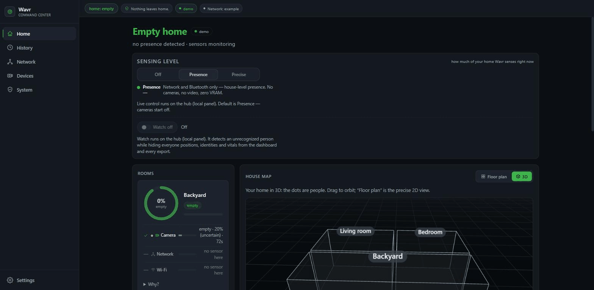
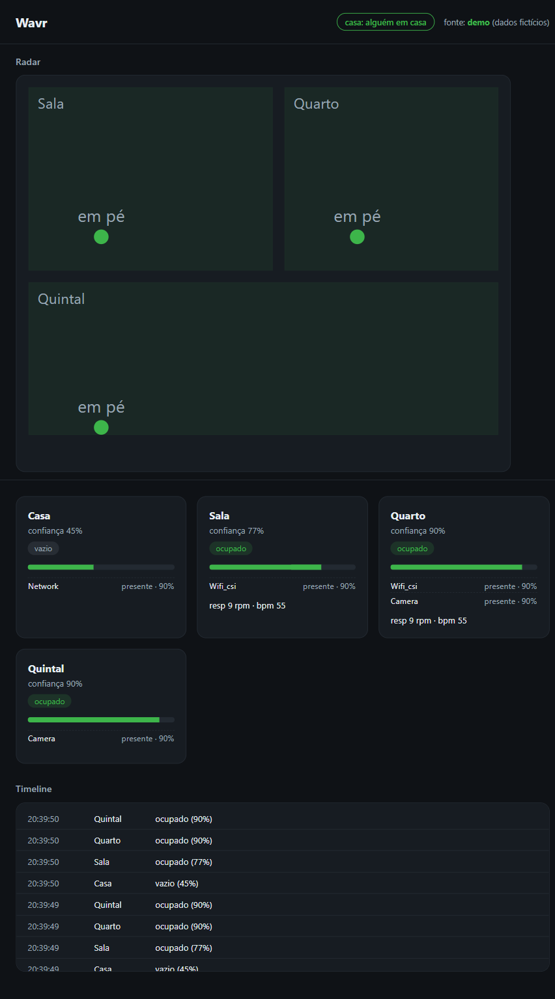
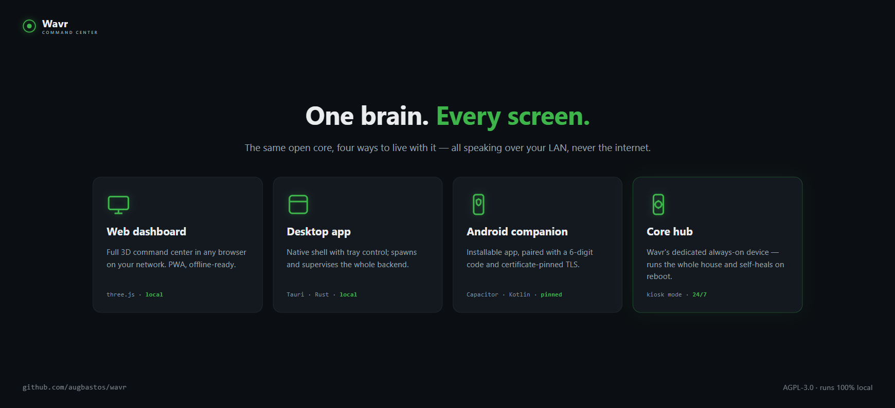
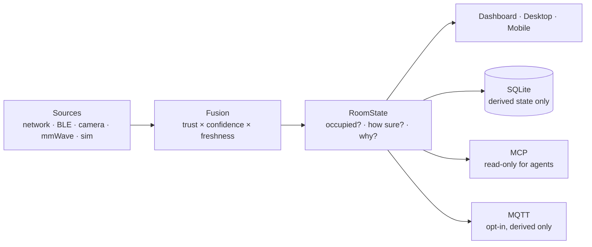

# 🌊 Wavr

[](https://github.com/augbastos/wavr/actions/workflows/tests.yml)
[](LICENSE)

**Your network already knows which of your devices are home. Wavr turns that — plus whatever sensors
you own — into a live, explainable map of your space, running entirely on hardware you own.**



Every room gets one answer, and **"I don't know" is more than one of them**: occupied, empty, a sensor
that is switched off or has stopped answering, or nothing watching at all. The first two carry a
confidence and the reasoning underneath; the others say which it is, because one is a repair and the
other is a purchase. Each modality's own reading stays visible
below the fused score, so one weak signal can never quietly claim certainty, and a room nothing watches
says so instead of reporting empty. You draw the floor plan; Wavr fills it in.

No account. No telemetry. No cloud service is required for anything Wavr does — the only paths off
the machine are individually switched on, and the AI narrator can point at a model running on the same
box. One exception, named rather than buried: camera person-detection downloads its model weights the
first time it runs, because they are not vendored here.

---

## What you get

|  | |
|---|---|
| **Explainable presence** | One confidence per room, from the best present evidence — trust weight × the source's own confidence × freshness decay — and lowered when something that can actually see the room disagrees. Every source's reading stays readable underneath, agreeing or not. |
| **Built for agents** | A read-only MCP server (stdio + HTTP) hands `RoomState` and the house map to your own agents as structured context. Home Assistant control is a separate, opt-in, default-OFF tool. |
| **Local by construction** | Loopback-only out of the box. Cameras boot OFF and frames never touch disk. A credential goes only where the authentication protocol needs it — never into a log, a response body, or a screen. |
| **You are the admin** | You draw the rooms, switch every sensor on and off, and decide what — if anything — is ever shared. |

**Try it with nothing installed:** open `frontend/index.html` in a browser. Opened from the filesystem
the dashboard switches itself to a built-in simulator, says so on screen, and makes zero network
requests.



---

## Quickstart

```bash
cd backend && pip install -e ".[dev]" && cd ..
python -m wavr.serve          # loopback-only, http://127.0.0.1:8000
```

Open it and Wavr asks you to name the place it watches, scans what the machine can do, and proposes
what it should become. There is no `.env` to edit — the wizard writes to the database and the Settings
screen exposes the rest. Already running an older Wavr? The wizard adopts it: nothing is re-paired, no
credential reissued, no camera touched.

Headless — a server, a container, anything over SSH — there is no tray and no dashboard to answer the one
question that matters, so:

```console
$ python -m wavr.status
Wavr
  Space         My Home
  Core          ● Healthy
  Uptime        1d 2h
  Last reading  4s ago
  Sensors       3 sensors reporting.
  Attention     Nothing needs your attention
```

`--json` for scripts. The exit code is the answer on its own: `0` healthy, `1` something needs a person,
`2` the Core is not responding. **"Last reading" is the line to watch** — a Core can be running and
producing nothing, and that is the failure worth catching.

Letting phones and tablets connect is a deliberate, separate step, because it changes what Wavr is
exposed to. Turn it on in Settings (it explains what changes first) or set `WAVR_MULTIDEVICE=1`.

---

## The family

One fusion engine, several surfaces, all reaching it over the same authenticated local channel. Pick
what you need; add more later.

| Surface | What it is |
|---|---|
| **Dashboard** | [`frontend/`](frontend/) — the web UI. Zero build step: a static shell plus classic scripts, opens from a file. |
| **Desktop** | [`desktop/`](desktop/) — the same dashboard as a native Tauri app. The machine running it is the *central*. |
| **Mobile** | [`mobile/`](mobile/) — an Android companion that pairs to a central over certificate-pinned TLS. Discovery goes through Android's own resolver instead of an in-process mDNS browse, because a phone VPN swallows the app's own multicast query — the failure was measured on a handset with a commercial VPN. |
| **Core** | [`core-launcher/`](core-launcher/) — an always-on appliance that *is* the hub: ambient panel, mDNS discovery, kiosk launcher. It has run on a dedicated Android phone; a mini PC or Raspberry Pi is a supported install route that has never been exercised on that hardware ([`docs/INSTALL.md`](docs/INSTALL.md)). |
| **MCP** | [`backend/wavr/mcp_serve.py`](backend/wavr/) — read-only presence for your own agents, over stdio or HTTP. |




*The Core's ambient panel: readable from across the room. Waking the full dashboard takes the admin PIN
or a fingerprint.*

---

## The privacy contract

Constraints the code holds, not intentions:

- **Loopback-only by default.** Peer check, Host allowlist, CSRF header. The base install never opens a
  LAN socket.
- **Cameras boot OFF.** Frames live in RAM, are never written to disk, never leave the machine. Position
  targets are live-only — never stored, never published.
- **Raw sensing is never stored or published.** What leaves the sensing layer is the derived
  observation — occupancy, confidence, timestamp — never a frame, never a raw position, never the
  evidence itself. Wavr does of course keep its own configuration: your rooms, your devices, your
  pairings, your settings. That is the difference between a product that remembers your home's shape
  and one that keeps a recording of it.
- **Every path off the box is opt-in and default-OFF** — LAN multi-device, MQTT to Home Assistant, the
  MCP control tool, the narrator. Turn none on and Wavr is an island.
- **Even the narrator can stay local.** Point it at Ollama or any loopback OpenAI-compatible server and
  the last summarising step never leaves the machine. Whichever provider you choose gets the same
  allowlisted prompt: occupancy and confidence, never a frame, a vital, a MAC or a credential.
- **No analytics, no telemetry, no account.** The frontend makes zero external requests.

---

## How it works


```mermaid
flowchart LR
    S["Sources<br/>network · BLE · camera · mmWave · sim"] --> F["Fusion<br/>trust × confidence × freshness"]
    F --> R["RoomState<br/>occupied? · how sure? · why?"]
    R --> D["Dashboard · Desktop · Mobile"]
    R --> DB[("SQLite<br/>derived state only")]
    R --> M["MCP<br/>read-only for agents"]
    R --> MQ["MQTT<br/>opt-in, derived only"]
```

**Backend** — Python 3.11 + FastAPI, with no mandatory heavy dependencies: torch/cv2, pyserial, paho,
bleak, cryptography and genai are lazy optional extras. **Frontend** — vanilla JS, no bundler, three.js
vendored same-origin, installable as a PWA.

Hardware paths are mock-tested, so the whole suite runs with no devices attached:

```bash
cd backend && pytest -q                   # no hardware needed (browser cases need playwright)
node mobile/scripts/sync-frontend.mjs     # packages the dashboard for the phone
node --test mobile/test/*.test.js         # the companion's own tests
```

Every surface above is in this repository. Nothing here needs a second checkout,
another branch or a git worktree to build or read.

---

## Why local-only is the point

The industry's default trajectory is the opposite of this project: your home read by someone else's
cloud, from operator-grade network sensing to the 6G push for joint communication-and-sensing, where
the radio layer itself becomes a sensor you don't control.

Wavr is the counter-position — the same sensing techniques, on hardware you own, with the data staying
on it. Local-only isn't a limitation here. It's the whole point: your home understood, without renting
the understanding back from anyone.

---

## Status

Early, and honest about it. Everything above ships in this tree with tests. What is **not** done: the
Android Core's embedded-engine build ([ADR-0010](docs/adr/0010-android-core-runtime.md)) is specified
but unexercised — the phone hub in use today runs the same Python engine in a container beside the
launcher. Radar and UWB have code paths and mock tests; neither has been exercised on real hardware. Wi-Fi CSI is a seam rather than a source — it needs a radio that exposes CSI, and nothing here has one.

This has been used by one person, on one household's worth of devices. Read version numbers
accordingly.

---

## Docs

- [`PRODUCT.md`](PRODUCT.md) — what exists and why
- [`project.json`](project.json) — the same, machine-readable, for an LLM reading this repo cold
- [`docs/WAVR-PROTOCOL.md`](docs/WAVR-PROTOCOL.md) — discovery, transport, pairing, capability
  manifests, sensing events, Core coordination
- [`docs/INSTALL.md`](docs/INSTALL.md) — every install route, and what to do when one fails
- [`docs/VOCABULARY.md`](docs/VOCABULARY.md) — the words this project uses on purpose
- [`docs/mcp-connect.md`](docs/mcp-connect.md) — connecting an agent over stdio or HTTP
- [`docs/NODE-ONBOARDING.md`](docs/NODE-ONBOARDING.md) — flashing and enrolling an ESP32 node
- [`docs/adr/`](docs/adr/) — the decisions and their trade-offs · [`docs/deploy/`](docs/deploy/) —
  hardening, Docker, hardware tiers · [`docs/network-fixes/`](docs/network-fixes/) — why LAN discovery
  fails, per router

---

## Contributing

Issues and pull requests welcome. Privacy invariants are non-negotiable: nothing leaves the LAN except
an egress you turned on, frames are never persisted, and a new source must be mock-testable without
hardware. Every PR needs green tests. A good first contribution is a new `SensorSource` — a Zigbee
occupancy sensor, another BLE beacon type.

Two house rules worth knowing before you write code:

1. **A guarantee needs a producer.** If something checks, something must produce what it checks. The
   most expensive defects in this repo have all been a working checker with nothing on the other side.
2. **Measure, don't guess.** "It feels slow", "it doesn't find it" — each has a specific cause, and a
   wrong hypothesis costs more than the measurement would have.

## License

[AGPL-3.0-or-later](LICENSE). Commercial use is permitted, on the AGPL's terms — it is a copyleft
licence, not a non-commercial one. The obligation that matters in practice: if you modify Wavr and let
people interact with it over a network, those users are entitled to the modified source. Running it
unmodified, or modifying it privately without offering it to anyone, triggers nothing.

A separate commercial licence is available for anyone who needs terms without that obligation — open an
issue to ask.
