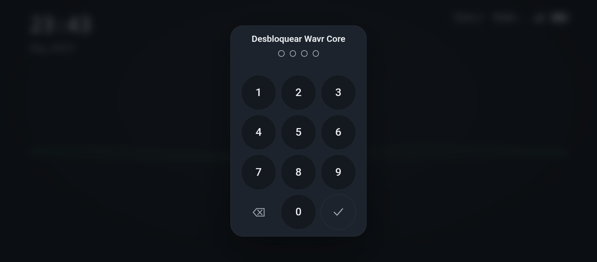
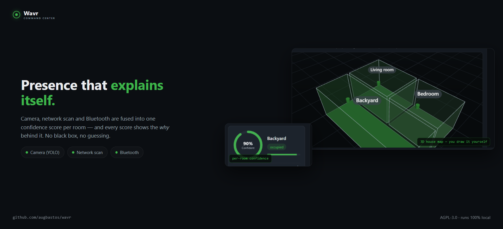
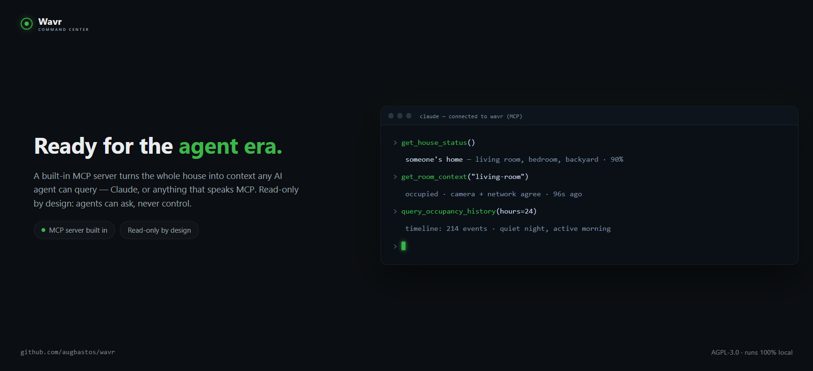
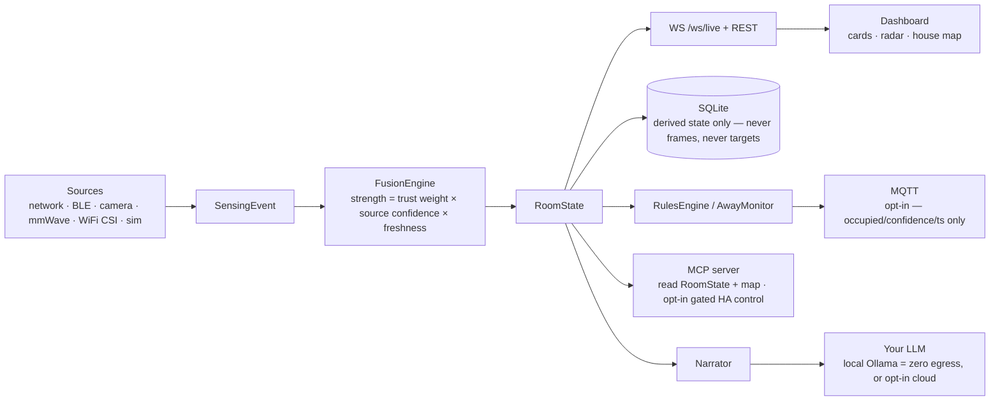

# 🌊 Wavr — The Spatial Layer for Your Local Network

[](https://github.com/augbastos/wavr/actions/workflows/tests.yml)
[](LICENSE)

**6 sensing modalities · 11 ADRs · 9 network-fix guides · every hardware path mock-tested, so the suite runs with no devices attached · local-only · MCP-for-agents · AGPL-3.0**

**Your network already knows who is home. Wavr turns it, plus whatever sensors you own, into a live and explainable model of your space — and lets your own AI agents ask about it over MCP. Runs 100% on hardware you own.**


Wavr fuses several sensing modalities into a single *explainable* `RoomState` per room: occupied or
not, a confidence score, and the per-modality *why* behind it — over a floor plan you draw yourself.
It ships a read-only MCP server so your own agents can query "who's home" as structured context, no
scraping required — see [MCP for agents](#mcp-for-agents) below. Nothing leaves the box unless you turn
on an optional, clearly-labelled egress. No account, no cloud, no telemetry.

- **🤖 Built for agents** — a read-only MCP server (stdio + HTTP) exposes `RoomState` and the house map
  as structured context for your own agents, plus an opt-in, default-OFF, gated Home Assistant control
  tool. See [MCP for agents](#mcp-for-agents) below.
- **🔍 Explainable fusion** — fused `confidence = strength`: the best present evidence (trust weight ×
  the source's own confidence × freshness decay), so a lone weak source never fakes 100%. Every
  source's own reading is surfaced, never silently arbitrated.
- **🏠 Local-only, zero cloud egress by default** — runs on your own hardware (laptop, Raspberry Pi, or a
  dedicated phone), loopback-only out of the box. The only paths off the machine are opt-in and default-OFF.
- **🛡️ You are admin, totally** — you draw the rooms, toggle every sensor on and off, and choose what (if
  anything) is ever shared. Cameras boot OFF; credentials never leave the box.

**Try it locally (no backend, no hardware):** open `frontend/index.html` — off-localhost the dashboard
self-switches to a built-in simulator (simulated data only, zero network requests).


## 🧩 The Wavr family

Wavr is a small family of surfaces around one local fusion engine — pick the ones you need, add more over time. Every surface talks to the central over the same authenticated, local-only channel.

- **Desktop** — the full dashboard as a native Tauri app; the machine that runs it is the "central".
- **MCP** — a read-only Model Context Protocol surface so your own agents can query presence over the LAN, with an opt-in, gated Home-Assistant control tool.
- **Mobile** — an Android-first companion (native shell) that pairs to a central over pinned TLS.
- **Core** — an always-on appliance that *is* the household hub: an ambient on-screen panel, zero-config mDNS discovery, and a boots-into-Wavr kiosk launcher. A Raspberry Pi or mini PC is the usual host; an Android phone can also run the Core itself, with the real Python engine embedded rather than a reduced copy ([ADR-0010](docs/adr/0010-android-core-runtime.md)) — that build is source-only and unsigned, and has not yet been run on a physical handset.


*The Core ambient panel: a calm green-wave presence face with glance-free status — time, Core & network health, Wi-Fi and battery — running on a dedicated phone in a stand.*



*Glance-free, control-gated: the ambient face is always readable; waking the full dashboard takes the admin PIN or biometric.*

## ✅ What's real today

Each item below ships in this tree with tests (hardware modalities are mock-tested where the physical
device isn't required). Full detail: `PRODUCT.md`, `docs/adr/`.



- <a id="wavr-space"></a>**A Space, with people and device functions as separate things — and person
  roles now actually gate access** — Wavr models the place it watches (`home`, `office`, `shop`, …),
  the *people* in it (Owner / Admin / User / Guest, capability-based) and the *job each device does*
  (Core / Node / Client, freely combined) as three independent axes. A first-run wizard names the
  Space, runs a local capability scan of the machine and proposes what it should become; settings that
  used to need a hand-edited `.env` are writable from the UI (ADR-0009, ADR-0011).
  <details><summary>Detail</summary>

  The three axes exist because one field used to mean two things: `role=central` said both "this
  credential may administer" and "this box is a hub". The existing per-device auth model
  (`backend/wavr/devices.py`) is deliberately **unchanged** — a person's role *derives* the credential
  role at pairing time. A second, independent mechanism now caps an already-issued credential too,
  resolved fresh on every request: a device's effective role is the narrower of what it was issued and
  what its person currently holds. Demoting someone takes effect on their very next request, from
  every device they hold; promoting someone never widens a token already out in the world — a
  deliberately asymmetric rule (ADR-0011). A device with no associated person, every Node, and every
  `agent` credential is unaffected.

  Several Cores per Space are representable and fenced by a monotonic epoch: promotion bumps the
  Space's generation, a Core that observes a higher epoch stands down immediately, and an equal-epoch
  conflict is broken deterministically **and reported** rather than absorbed. Automatic failover is
  deliberately **not** implemented — `promotion_candidate()` names who should take over and a human
  decides. The capability scan is tristate: anything it could not determine reads "couldn't tell",
  never "no".

  The settings store is an allow-list of existing `WAVR_*` flags, no secret is storable in it, and
  the environment always wins over it — an operator's `.env` can never be overridden by a UI click.
  </details>

- <a id="mcp-for-agents"></a>**MCP for agents, read-only by default — now with the Space itself as
  context** — a stdio and HTTP MCP server exposes `RoomState`, the house map, and Wavr's own Space
  model (current occupancy, sensor coverage, Core health) so your own agents can query "what's
  happening here" as structured context; an opt-in, default-OFF, gated Home Assistant control tool
  sits behind an allowlist + audit log (ADR-0005, ADR-0008).
  <details><summary>Detail</summary>

  Allowlist + consent refusal on both the service *and* the target entity; camera / lock / scene
  refused even if allowlisted; mass actuation blocked; every call audit-logged. Person labels are
  stripped from the MCP read path as PII.

  Five Space-model tools: `get_space_context`, `explain_room_state`, and `get_sensor_coverage` (which
  rooms have no sensor at all — a blind spot is not an empty room) and `get_core_health` sit in the
  DEFAULT agent grant alongside the original `list_rooms`/`get_room_context`/`get_house_status`.
  `get_device_context` (what job each paired device does) does **not** — like the LAN inventory,
  alerts, occupancy history, and HA-entity tools before it, it's a household-census-shaped surface an
  operator must explicitly grant, never a default. No per-person biometric, positional, or name data
  is exposed by any of them — see [`docs/mcp-connect.md`](docs/mcp-connect.md) for the full tool table.
  </details>

- **Multi-modal fusion, explainable by construction** — 6 sensing sources (network scan, BLE, camera,
  mmWave, WiFi CSI/ruview, simulator) feed one `FusionEngine`. Fused `confidence` equals `strength` —
  trust weight × the source's own confidence × freshness decay — so a lone weak source never fakes
  100%, and every source's own reading rides in `sources[]`, never silently arbitrated.
  <details><summary>Per-modality status</summary>

  - Network scan — works today, zero extra hardware.
  - BLE presence — host Bluetooth adapter (lazy `bleak`).
  - Camera — RTSP person-detection via the `[camera]` extra (torch/cv2), lazy-loaded; boots **OFF**,
    frames processed in RAM, never persisted (ADR-0002). Reports room-level presence — which room a
    person is in — not invasive per-person coordinates.
  - mmWave radar — an HLK-LD2450 (~€15) protocol parser, mock-tested against the wire format.
  - WiFi CSI (ruview) — a source seam for channel-state-information presence.
  - **Three honest states, not a guess** — a periodic re-fuse pass (`WAVR_REFUSE_S`, default 5s) decays
    a stopped source to zero instead of freezing on its last reading. The map always shows which of
    three states a room is in: **confirmed-empty** (a working sensor with nobody there), **offline**
    (amber — a sensor that stopped reporting), or **no coverage** (no sensor watching that room at
    all) — never blended into a false "clear."
  </details>

- **3D house map + live sensing control** — draw multi-floor rooms, walls, and stairs yourself, in
  meters, persisted via `PUT /api/house`; a top-level **Off / Presence / Precise** meter shows exactly
  how much of the home Wavr is sensing right now and lets you toggle camera detection on or off.

- **Locally authenticated, scoped multi-device access** — Wavr Pass gives each paired device
  role-based scopes (read / control / admin) enforced per-route on the box (ADR-0006); pairing uses
  local HTTPS/WSS, a rotating single-use 8-digit code, and an out-of-band certificate-fingerprint check
  that defeats a pairing-time MITM.
  <details><summary>Detail</summary>

  Per-device hashed revocable tokens, single-use WS tickets, an in-subnet real-peer check. A device's
  role can be changed after pairing (Admin-only; a User can never promote itself). Opt-in, default-OFF,
  zero cloud.
  </details>

- **Non-biometric "who is home"** — an opt-in, default-OFF layer maps a known device (Bluetooth
  address or Wi-Fi MAC) to a named person; house-level, not per-room, and non-biometric (device-to-person,
  no faces). Stripped from the MCP read path as PII when the flag is off.

- **Ships as a desktop app + installable PWA** — a native Tauri shell (`desktop/`, ADR-0007) and a
  zero-build installable Progressive Web App that makes zero external requests off-localhost. On
  Windows the shell now bundles the whole Core into the installer itself (a frozen ~40 MB executable,
  `desktop/sidecar/`) — installing needs no separate Python. Built and verified locally with every
  Python stripped from PATH; **no release has been published yet**, so there is nothing to download —
  see [`docs/INSTALL.md`](docs/INSTALL.md) for the route that works today.

- **Defensive LAN inventory + honest network diagnosis** — offline OUI vendor/device-type
  classification, rogue-device / gateway-MAC / rogue-DHCP alerts on a five-tier ladder (ADR-0004,
  defensive-only), and a network doctor that names a *likely* cause without ever confirming blame —
  backed by 9 fix guides in [`docs/network-fixes/`](docs/network-fixes/).



Wavr does not reimplement sensing research — it orchestrates sensing engines as plugins and is honest
about each one's confidence. Fusion never lets a single weak source fake certainty, and every reading
carries the trust weight and freshness that produced it.

## 🔒 The privacy contract

- **Loopback-only by default** — peer check + Host allowlist + CSRF header. The base install never
  opens a LAN socket.
- **Cameras boot OFF.** Frames live in RAM only, are never written to disk, and never leave the box
  (ADR-0002). Position targets are live-only — never SQLite, never MQTT.
- **Only derived state is ever stored or (optionally) published** — occupancy / confidence / timestamp.
  Never frames, never raw targets, never credentials. Credentials are never logged or echoed.
- **Every egress is opt-in and default-OFF.** The only paths off the box — LAN multi-device (TLS), MQTT
  to Home Assistant (derived state only), the MCP control tool, and the natural-language narrator — are
  each a switch you flip. Turn none on and Wavr is an island.
- **Even the AI narrator can stay local.** It's provider-agnostic: point it at a **local Ollama** (or any
  loopback OpenAI-compatible server) and that last summarizing step stays on your box with **zero cloud
  egress** — or pick Gemini / OpenAI / Claude if you'd rather (opt-in cloud). Every provider gets the same
  allowlisted prompt: occupancy and confidence only, never a frame, vital, MAC, or credential.
- **No analytics, no telemetry SDK, no account.** The frontend makes zero external requests; the public
  simulator declares itself fake on screen.

## ⚡ Quickstart (network presence, zero hardware)

```powershell
cd backend; pip install -e .[dev]; cd ..
python -m wavr.serve            # loopback-only HTTP on http://127.0.0.1:8000
```

Running it headless — a Pi, a server, anything reached over SSH — means the tray
and the dashboard are not available to answer the one question that matters:

```console
$ python -m wavr.status

Wavr
  Space         My Home
  Core          ● Healthy
  Uptime        1d 2h
  Last reading  4s ago
  Sensors       3 sensors reporting.
  Attention     Nothing needs your attention
```

`--json` for scripts, and the exit code is the answer on its own: `0` healthy,
`1` something needs a person, `2` the Core is not responding. **"Last reading"
is the line to look at** — a Core can be running and producing nothing, and that
is the failure worth catching.

Open it and Wavr asks you to name the place it is watching, scans what the machine can do, and proposes
what it should become. No `.env` to edit — the settings the wizard writes live in the database, and the
Settings screen exposes the rest.

Already running an older Wavr? The wizard offers to adopt the existing install instead: nothing is
re-paired, no credential is reissued, no camera is touched.

Tests: `python -m pytest backend/tests -q` (full suite, all hardware mock-tested).

Letting phones and tablets connect is a deliberate, separate step, because it changes what Wavr is
exposed to — turn it on in Settings (Wavr explains what changes first) or set `WAVR_MULTIDEVICE=1`.
See [`docs/deploy/multi-device.md`](docs/deploy/multi-device.md), [`docs/INSTALL.md`](docs/INSTALL.md)
and the Tauri shell in [`desktop/`](desktop/).

## 🏗️ How it works


```mermaid
flowchart LR
    S["Sources<br/>network · BLE · camera · mmWave · WiFi CSI · sim"] --> E["SensingEvent"]
    E --> F["FusionEngine<br/>strength = trust weight × source confidence × freshness"]
    F --> R["RoomState"]
    R --> WS["WS /ws/live + REST"] --> D["Dashboard<br/>cards · radar · house map"]
    R --> DB[("SQLite<br/>derived state only — never frames, never targets")]
    R --> RA["RulesEngine / AwayMonitor"] --> MQ["MQTT<br/>opt-in — occupied/confidence/ts only"]
    R --> M["MCP server<br/>read RoomState + map · opt-in gated HA control"]
    R --> N["Narrator"] --> LLM["Your LLM<br/>local Ollama = zero egress, or opt-in cloud"]
```

- **Backend:** Python 3.11, FastAPI, zero mandatory heavy deps — torch/cv2, pyserial, paho, bleak,
  cryptography and genai are lazy optional extras (`[camera]`, `[mmwave]`, `[mqtt]`, `[tls]`, `[genai]`).
- **Frontend:** single static HTML file (three.js), no build step, installable as a PWA. Off-localhost it
  self-switches to a simulator and makes zero requests to the backend.

## 🧭 Design stance: your home, understood — without giving it away

The industry's default trajectory is the opposite of this project: your home read by someone else's
cloud, from operator-grade network sensing to the 6G push for joint communication-and-sensing, where the
radio layer itself becomes a sensor you don't control. Wavr is the sovereign counter-position — the same
sensing techniques, run on hardware you own, with the data staying on it. Local-only isn't a limitation
here; it's the whole point. You get your home understood without renting the understanding back from
anyone.

## 🤝 Contributing

Issues and PRs welcome. Ground rules: privacy invariants are non-negotiable (nothing leaves the LAN
except an opt-in egress you enabled; frames are never persisted; new sources must be mock-testable
without hardware), and every PR needs green tests (`python -m pytest backend/tests -q`). Good first
contributions: a new `SensorSource` (zigbee occupancy, a new BLE beacon type, …).

## 📚 Docs

- `PRODUCT.md` — product definition and design principles
- [`docs/WAVR-PROTOCOL.md`](docs/WAVR-PROTOCOL.md) — Wavr Protocol v1: discovery, transport, pairing,
  capability manifests, sensing events, Core coordination
- [`docs/INSTALL.md`](docs/INSTALL.md) — every install route and what to do when one fails
- [`docs/NODE-ONBOARDING.md`](docs/NODE-ONBOARDING.md) — flashing and enrolling an ESP32 sensor node
- [`docs/mcp-connect.md`](docs/mcp-connect.md) — connecting an agent over stdio or HTTP
- `docs/deploy/` — hardening, Docker, hardware tiers, multi-device bring-up
- `docs/network-fixes/` — why LAN discovery fails and how to fix it, per router
- `docs/adr/` — architecture decision records (0001–0011: mmWave-over-fork, RAM-only privacy
  boundaries, not-a-medical-device, defensive-only, MCP control boundary, authenticated LAN access,
  desktop shell, MCP-over-HTTP transport, Space + people + device functions, the Android Core runtime,
  person-role authorization)

## ⚖️ License

[AGPL-3.0-or-later](LICENSE) — Wavr is free and open source for personal, self-hosted, and
non-commercial use. If you run a modified version as a network service, the AGPL requires you to publish
your changes. A **commercial / dual license** (to use Wavr without the AGPL's network-copyleft
obligations) is available from the author — open an issue to enquire.
